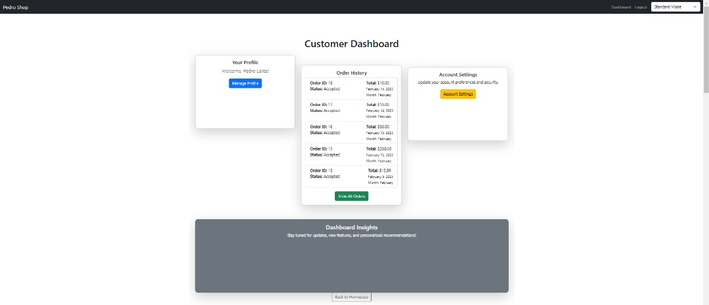
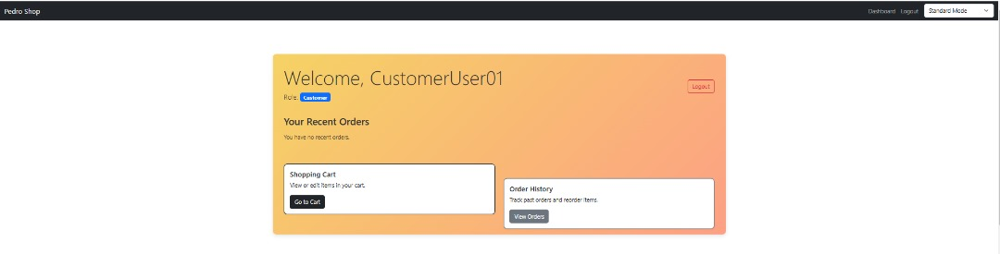
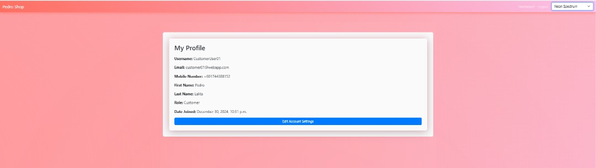

# 🛒 MyPersonalEcommerce - Secure Django E-commerce Platform

<p align="center">
  <em>A robust and secure e-commerce platform built with Django, featuring distinct roles for Admins, Merchants, and Customers, with a strong emphasis on security best practices.</em>
  <br><br>
  
  
  
  
  
  <br>
  
  <br>
  <sub style="font-family: 'Space Mono', monospace; color: #7DF9FF;">Your visit sparks innovation! 🔥</sub>
</p>

---

## 🚀 Project Overview

`MyPersonalEcommerce` is a feature-rich e-commerce application developed using the **Django framework**. It provides a multi-faceted platform catering to three distinct user roles: **Administrators**, **Merchants**, and **Customers**. The core design prioritizes **security**, incorporating measures like data encryption, input validation, brute-force protection, and secure authentication flows, while offering essential e-commerce functionalities. The application also features dynamic theming options, including a vibrant "Neon Spectrum" mode.

---

## 🛡️ Security First Approach

Security is a cornerstone of this platform. Key implemented measures include:

* 🔑 **Robust Authentication & Authorization:**
    * Distinct login portals and dashboards for Customers and Merchants.
    * Strict role-based access control (RBAC) enforced via middleware and decorators (`@user_passes_test`).
    * Secure handling of user sessions and authentication tokens.
    * Integration with `django-allauth` for streamlined social login (Google implemented).
* 🔒 **Data Encryption:**
    * Sensitive user data (e.g., address, phone number in `Order` model) is encrypted at rest using `fernet_fields` and a strong encryption key (`FERNET_KEY` in settings).
    * Secure key management practices are essential for production (e.g., environment variables, KMS). A Celery task (`rotate_keys`) is stubbed out for future key rotation implementation.
* 🛡️ **Input Validation & Sanitization:**
    * Django forms (`forms.py`) enforce data types, lengths, and specific formats (e.g., phone numbers, addresses).
    * Use of `bleach` library to sanitize user-generated content (like product descriptions, reviews) against Cross-Site Scripting (XSS) attacks.
* ⚙️ **Rate Limiting & Brute-Force Protection:**
    * Integration with `django-axes` to monitor and block suspicious login activity based on failed attempts per username.
* 🤖 **CAPTCHA Integration:**
    * Utilizes `django-simple-captcha` on critical forms (Registration, Login) to prevent automated bot submissions.
* 📩 **Secure Password Recovery:**
    * Implemented an Email-based One-Time Password (OTP) system for secure password resets. OTPs are time-limited and marked as used.
* 🖼️ **Image Security:**
    * Image uploads are handled, and Pillow library is used to resize large images, mitigating potential denial-of-service risks from overly large files.
* 🔐 **CSRF Protection:** Django's built-in Cross-Site Request Forgery protection is enabled via middleware.
* **Logging:** Comprehensive logging is configured to track application events, errors, and security-related incidents.

---

## ✨ Application Showcase

Here's a visual walkthrough of the platform's key areas:

<details>
<summary>👤 Customer Experience</summary>

| Screenshot                                     | Description                                       |
| :--------------------------------------------- | :------------------------------------------------ |
|  | The main landing page or product listing view.    |
|  | The initial view of the customer's dashboard. |
|  | Another view or section of the customer dashboard. |
|  | Customers can view their past orders.        |
|  | The shopping cart interface.                    |
|  | User's profile information page.            |
|  | Page for updating account details.         |
|  | *Note: Filename suggests merchant, verify image.* |

</details>

<details>
<summary>🛍️ Exploring & Shopping</summary>

| Screenshot                                          | Description                                                     |
| :-------------------------------------------------- | :-------------------------------------------------------------- |
|  | Browse the product catalog.                             |
|  | Another view of the product catalog or product details.   |
|            | Alternate view of the main screen or product display.     |
|              | Option to sign in using Google via django-allauth.        |

</details>

<details>
<summary>🏪 Merchant Portal</summary>

| Screenshot                                          | Description                                                |
| :-------------------------------------------------- | :--------------------------------------------------------- |
|  | Dedicated login page for merchants.                        |
|  | Overview dashboard for merchants.                          |
|  | Additional dashboard section or view for merchants.        |
|  | Interface for merchants to add new products.             |
|  | Merchants viewing and managing orders for their products. |

</details>

<details>
<summary>⚙️ Admin Panel & Control</summary>

| Screenshot                                                    | Description                                                              |
| :------------------------------------------------------------ | :----------------------------------------------------------------------- |
|                    | Login screen for administrators (likely the standard Django admin).    |
|            | Custom Admin dashboard view showing statistics and recent orders.        |
|          | Admin view listing all orders in the system.                           |
|        | Standard Django admin interface for managing models.                     |
|  | Filtering or selecting products based on category in the admin. |
|  | Viewing or selecting a specific order in the admin interface.            |
|  | Detailed view or action page for a specific order in the admin.        |
|  | Admin view of the Product model data.                                  |
|  | Likely showing user email data (CustomUser model) in the admin.        |
|  | Another view or filter of user email data in the admin.                |

</details>

---

---

## 🎥 Short Project Demo

Check out a quick glimpse of the current functionality:


---

## 🌟 Core Features

* **Multi-Role System:** Distinct functionalities and interfaces for Admins, Merchants, and Customers.
* **User Authentication:**
    * Standard Email/Username & Password Login.
    * Secure Registration with CAPTCHA.
    * Google Social Login (`django-allauth`).
    * Separate Merchant Login Portal.
    * Secure Logout.
* **Password Management:** Forgot Password flow using Email OTP verification.
* **Product Management (Merchant):**
    * Add, Edit, and Delete Products.
    * Manage Product Details (Name, Description, Price, Stock, Category, Image).
    * Input sanitization for descriptions.
    * Stock level automatically updates availability.
* **Product Browse (Customer):**
    * Product Listing with Pagination.
    * Filter by Category.
    * Product Search Functionality (Basic implementation, Haystack configured for potential Elasticsearch integration).
    * Detailed Product View.
* **Shopping Cart:** Add, Remove, View items in the cart (Session-based via `cart.py`).
* **Checkout Process:**
    * Secure form (`CheckoutForm`) for collecting address and phone (encrypted).
    * Basic payment method selection (UI only, no processing yet).
    * Stock level checks during checkout.
    * Atomic transactions to ensure data integrity during order creation.
* **Order Management:**
    * Customers: View Order History.
    * Merchants: View orders containing their products, view order details.
    * Admins: View all orders, view details, update status, edit/delete orders (via custom admin views and standard Django admin).
* **Admin Panel:**
    * Custom Admin Dashboard with key statistics (Users, Orders, Products).
    * User Management (List, View, Edit, Delete - with safeguards).
    * Standard Django Admin interface for managing all models.
    * Customized display for `Order` model showing raw encrypted data (for debugging/verification).
    * Customized `AccessAttempt` admin view (`django-axes`) to view/unlock locked accounts.
    * View System Logs (`LogEntry`).
* **Theming:** Switch between a standard theme (`style.css`) and a vibrant neon theme (`vibrant-mode.css`) using JavaScript and CSS variables. Includes advanced animations.
* **Security:** Comprehensive security measures as detailed in the "Security First Approach" section.

---

## 💻 Tech Stack

* **Backend Framework:** Django 5.1+
* **Programming Language:** Python 3.x
* **Database:** SQLite3 (Default), PostgreSQL compatible (requires `settings.py` update and `psycopg2` installation)
* **Frontend:**
    * HTML5
    * CSS3 (including CSS Variables, Animations, Flexbox, Grid)
    * JavaScript (ES6+)
    * Bootstrap 5.3
    * Animation Libraries: `anime.js`, `GSAP (gsap.min.js)`
    * Charting: `Chart.js`, `Google Charts`
* **Authentication:** `django-allauth` (for Google Login), Django's built-in auth.
* **Security:**
    * `django-axes` (Rate Limiting / Brute-force Protection)
    * `django-simple-captcha` (CAPTCHA)
    * `fernet-fields` (Field-level Encryption)
    * `cryptography` (Core encryption library used by `fernet-fields`)
    * `bleach` (HTML Sanitization)
* **Forms:** Django Forms, `django-widget-tweaks` (for form rendering flexibility).
* **Asynchronous Tasks:** Celery (configured in `settings.py`, `celery.py`, `tasks.py` - requires setup).
* **Search:** `django-haystack` (configured for Elasticsearch, requires setup).
* **Development Tools:** `django-extensions`.
* **Image Handling:** `Pillow`.

---

## 🏗️ Project Structure

The project is organized into three main Django apps within the `ecommerce` project directory:

1.  **`ecommerce` (Main Project App):**
    * Contains project-wide settings (`settings.py`), main URL configuration (`urls.py`), WSGI/ASGI configurations.
    * Holds base templates (`templates/base.html`) and global static files (`static/css/style.css`, `static/js/`, etc.).
    * Includes the vibrant theme CSS (`static/css/vibrant-mode.css`) and associated theme-switching JS in `base.html`.
2.  **`products` App:**
    * Manages product catalog, categories, orders, order items, and reviews.
    * Contains models (`models.py`), views (`views.py`), forms (`forms.py`), URLs (`urls.py`), and templates specific to products, cart, checkout, and order management (`templates/products/`).
    * Includes the shopping cart logic (`cart.py`) and background tasks (`tasks.py`).
3.  **`users` App:**
    * Manages user authentication, profiles, and roles.
    * Defines the `CustomUser` model (`models.py`) extending Django's `AbstractUser`.
    * Contains views (`views.py`) for registration, login (customer & merchant), logout, dashboards, password reset (OTP), and account settings.
    * Includes specific forms (`forms.py`) for authentication and user management.
    * Defines user-related URLs (`urls.py`).
    * Includes utilities for OTP handling (`utils.py`, `sms_utils.py` - though SMS sending might not be fully implemented).

---

## 🛠️ Installation & Setup

1.  **Clone the Repository:**
    ```bash
    git clone <your-repository-url>
    cd MyPersonalEcommerce
    ```

2.  **Create and Activate Virtual Environment:**
    ```bash
    python -m venv venv
    # Windows
    venv\Scripts\activate
    # macOS/Linux
    source venv/bin/activate
    ```

3.  **Install Dependencies:**
    * Ensure you have a `requirements.txt` file. If not, create one: `pip freeze > requirements.txt`
    ```bash
    pip install -r requirements.txt
    ```
    * *Note:* If planning to use PostgreSQL, install `psycopg2-binary` or `psycopg2`.

4.  **Configure Environment Variables / Settings:**
    * **Crucially, update `ecommerce/settings.py`:**
        * Set a strong `SECRET_KEY`. **Do not use the insecure default key in production.**
        * Generate a `FERNET_KEY` (`python -c "from cryptography.fernet import Fernet; print(Fernet.generate_key().decode())"`) and store it securely (e.g., environment variable). Update `settings.FERNET_KEY`.
        * Configure `DATABASES` if using PostgreSQL.
        * Add your Google `client_id` and `secret` for `SOCIALACCOUNT_PROVIDERS`.
        * Configure `EMAIL_BACKEND`, `EMAIL_HOST`, `EMAIL_PORT`, `EMAIL_HOST_USER`, `EMAIL_HOST_PASSWORD` for email functionality (OTP, etc.). **Use an App Password for Gmail.**
        * Review `ALLOWED_HOSTS` for deployment.
        * Set `DEBUG = False` for production.
    * Consider using a `.env` file and `python-dotenv` to manage these settings securely.

5.  **Apply Database Migrations:**
    ```bash
    python manage.py makemigrations
    python manage.py migrate
    ```

6.  **Create Superuser (Admin):**
    ```bash
    python manage.py createsuperuser
    ```
    *Follow the prompts. Remember to set the role to 'admin' if managing via the custom admin user interface.*

7.  **Collect Static Files (for production):**
    ```bash
    python manage.py collectstatic
    ```

8.  **Run Development Server:**
    ```bash
    python manage.py runserver
    ```
    *Access the application at `http://127.0.0.1:8000/`.*

9.  **(Optional) Setup Celery & Elasticsearch:**
    * If using Celery for background tasks or Elasticsearch (via Haystack) for search, follow their respective setup guides (install Redis/RabbitMQ for Celery broker, setup Elasticsearch instance, run workers, etc.).

---

## 🗺️ Development Roadmap (Future Enhancements)

The platform is actively evolving. Key future enhancements include:

* ✅ **Payment Gateway Integration:** Integrate Stripe, PayPal, or other providers for real-time payment processing.
* ⏳ **Advanced Product Management:** Implement product variations, detailed inventory tracking, bulk import/export.
* 🎨 **UI/UX Overhaul:** Develop a more modern and responsive frontend, potentially using a JS framework or enhancing templates with HTMX/Alpine.js.
* 📊 **Enhanced Dashboards:** Add more detailed analytics and reporting for Admins and Merchants (sales trends, user behavior).
* 🚢 **Dockerization:** Create `Dockerfile` and `docker-compose.yml` for easy containerized deployment.
* 🔍 **Advanced Search:** Fully implement Elasticsearch/Haystack for powerful product searching and filtering.
* ⭐ **Product Reviews & Ratings:** Enhance the existing basic review system.
* 🔔 **Notifications System:** Implement user notifications (e.g., order updates, low stock alerts).
* 🧪 **Comprehensive Testing:** Increase test coverage (unit, integration tests).
* 🔄 **Key Rotation:** Implement the `rotate_keys` Celery task for automated encryption key rotation.
* 📱 *(Optional)* **Progressive Web App (PWA):** Enhance mobile experience.

---

## 💡 Contributing

Contributions are welcome! If you'd like to improve the platform:

1.  **Fork** the repository.
2.  Create your **Feature Branch** (`git checkout -b feature/YourAmazingFeature`).
3.  **Commit** your Changes (`git commit -m 'feat: Add YourAmazingFeature'`). Adhering to [Conventional Commits](https://www.conventionalcommits.org/en/v1.0.0/) is appreciated.
4.  **Push** to the Branch (`git push origin feature/YourAmazingFeature`).
5.  Open a **Pull Request** detailing your changes and their purpose.

Let's collaborate to build a more secure and functional e-commerce solution! 🚀

---

## 📞 Contact

* **Developer:** Pedro Fabian Owono Ondo Mangue
* **GitHub:** [](https://github.com/Owono2001)
* For bug reports, feature requests, or other inquiries, please **create an issue** on this GitHub repository.

---